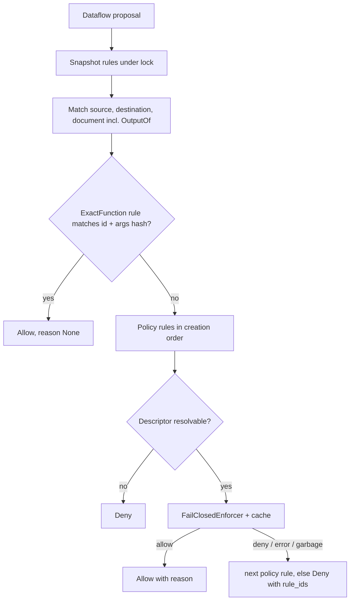

# Pluggable rules package with policy rules

## Target layout (repo: `aauth`)

```
aauth/src/aauth_edocs/
  rules/
    __init__.py       # public re-exports
    model.py          # ExactFunction, Policy, DataflowRule, StoredRule, Allow, Deny, RuleDecision
    protocols.py      # RuleEvaluator, RuleAdmin
    engine.py         # RuleEngine (replaces MutableControllerRuleEngine)
    policy.py         # PolicyEnforcer protocol, PolicyQuestion, PolicyVerdict, FailClosedEnforcer, CachingEnforcer
    serialization.py  # rule JSON (parse_rule_body, serialize_rule, parse_rule)
  dataflow_json.py    # parse_dataflow / serialize_dataflow (moved from rule_json.py; used by sentinel too)
  controller.py       # issue_controller_decision only (token signing stays here)
```

Delete `rule_json.py` and `rule_store.py`. Remove `ExactRule` from [edocs.py](aauth/src/aauth_edocs/edocs.py), and remove `ControllerRuleEngine` and `ControllerRuleEvaluator` from [controller.py](aauth/src/aauth_edocs/controller.py). `rules/` imports `edocs` (`Dataflow`, `OutputOf`, `DerivedEdoc`, `FunctionDescriptor`) and never imports `tokens` or `keys`.

## Model

```python
@dataclass(frozen=True)
class ExactFunction:
    id: str
    canonical_arguments: str = "{}"   # pinned, as today

@dataclass(frozen=True)
class Policy:
    text: str                          # arguments not pinned; the enforcer sees them

@dataclass(frozen=True)
class DataflowRule:
    source: str
    function: ExactFunction | Policy
    document: str | OutputOf
    destination: str
    prerequisite: Dataflow | None = None   # exact only

@dataclass(frozen=True)
class Allow:
    rule_id: str
    rule: DataflowRule
    reason: str | None = None

@dataclass(frozen=True)
class Deny:
    reason: str
    rule_ids: tuple[str, ...] = ()

RuleDecision = Allow | Deny
```

`StoredRule(rule_id: str, rule: DataflowRule)` keeps its current shape. `rule_id` is required.

## Evaluation (`RuleEngine.evaluate`)



- Keep the existing `OutputOf` resolution logic from `rule_store.py` (`_matches`), applied to the non-function fields.
- Never call the enforcer while holding the lock. Take a snapshot of candidate rules first.
- `RuleEngine(rules=(), *, derived_resolver=None, function_resolver=None, enforcer=None)`. `function_resolver: Callable[[str], FunctionDescriptor | None]`, and the demo passes `registry.functions.get`.
- Creating a policy rule raises `ValueError` if the engine has no `enforcer`, so a rule can't sit there silently denying.
- Duplicate check: exact rules keep today's duplicate-target check. Policy rules are duplicates only if source, document, destination and text are all identical.

## Policy enforcer (interface only)

```python
@dataclass(frozen=True)
class PolicyQuestion:
    policy: str
    proposal: Dataflow
    function: FunctionDescriptor   # Sentinel-registered, digest-pinned

@dataclass(frozen=True)
class PolicyVerdict:
    allowed: bool
    reason: str

class PolicyEnforcer(Protocol):
    def judge(self, question: PolicyQuestion) -> PolicyVerdict: ...
```

- `FailClosedEnforcer(inner)`: any exception, a non-`PolicyVerdict` result, or a missing reason becomes a deny.
- `CachingEnforcer(inner)`: key is (rule_id, policy text, function id, function digest, args hash). The engine wraps whatever enforcer it's given as caching over fail-closed.
- No LLM SDK dependency. Tests use a fake enforcer.

## Protocols and AS wiring

- `RuleEvaluator.evaluate(proposal) -> RuleDecision`.
- `RuleAdmin`, `runtime_checkable`: `list_rules`, `get_rule`, `create_rule(body: dict)`, `replace_rule(rule_id, body)`, `delete_rule`, `serialize(stored) -> dict`, `reads(stored, edoc_id) -> bool`. The engine parses its own JSON, using the functions in `serialization.py`.
- [asrv.py](aauth/src/aauth_edocs/asrv.py): `rule_engine: RuleEvaluator | None`. The `/rules` routes check `isinstance(rule_engine, RuleAdmin)` instead of the concrete class, and pass JSON bodies straight through. Remove `_parse_rule_body` and `_reads`, which move into the engine.
- [controller.py](aauth/src/aauth_edocs/controller.py): `issue_controller_decision` calls `evaluate`. On `Deny` it raises `AAuthError(DENIED, 403, ...)` with a generic message, so the enforcer's reasoning doesn't leak to the requester. On `Allow` it reads `decision.rule.prerequisite`.

## Rule JSON (wire format)

The target has exactly one of `function` (plus `function_args`) or `policy`:

```json
{"rule_id": "...", "target": {"source": "...", "document": "...", "destination": "...", "policy": "Only aggregates are allowed"}, "prerequisite": null}
```

Existing exact-rule JSON (`function` plus `function_args`) is unchanged, so current clients keep working.

## Downstream updates (separate git repos; build on top of their existing uncommitted edits, no commits)

- `aauth`: [__init__.py](aauth/src/aauth_edocs/__init__.py) exports. [sentinel.py](aauth/src/aauth_edocs/sentinel.py) imports from `dataflow_json`. Update the tests `test_controller.py`, `test_rule_store.py` (renamed to `test_rules_engine.py`), `test_as_rules.py`, `test_as_edocs.py`, `test_sentinel.py`, `test_sentinel_http.py` and `test_edocs.py`: swap `ControllerRuleEngine((ExactRule(flow),))` for `RuleEngine((exact_rule(flow),))` and add a small `exact_rule(dataflow, prerequisite=None)` helper in `rules`. Add `test_rules_policy.py` covering fake-enforcer allow, deny, exception, garbage output, missing descriptor, cache hit, exact-before-policy ordering, rejecting policy rules when there's no enforcer, and the enforcer not being called while the lock is held.
- `mcp-aauth`: [tests/test_edocs_end_to_end.py](mcp-aauth/tests/test_edocs_end_to_end.py) gets the same swap.
- `mcp-aauth-codex`: [demo.py](mcp-aauth-codex/src/mcp_edocs_agent/demo.py) uses `RuleEngine` with `function_resolver=self.registry.functions.get`. The policy routes in [control_panel.py](mcp-aauth-codex/src/mcp_edocs_agent/control_panel.py) delegate body parsing to `policy.create_rule(body)` / `replace_rule(rule_id, body)`.
- `mcp-edocs-provider`: no rule usage. It only uses `FunctionDescriptor`, which is unchanged.
- `ps.py` is not touched.

## Verify

Run `pytest` in `aauth`, `mcp-aauth` and `mcp-aauth-codex`.
